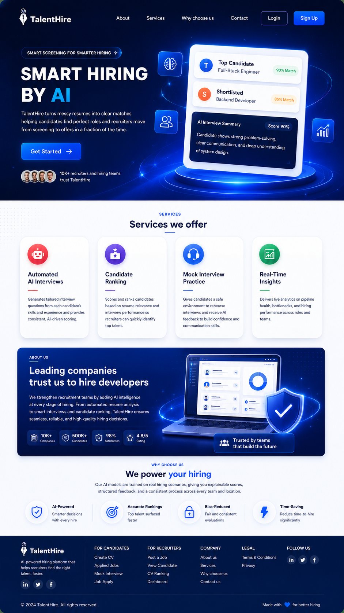

# TalentHire

**TalentHire** is an AI-powered recruitment and interview assessment platform. It helps candidates build and manage CVs, allows recruiters to post jobs and evaluate applicants, and uses NLP/AI services for resume parsing, job matching, mock interviews, and real interview assessment.

The project is built as a multi-service system:

- **React + Vite frontend** for candidate, recruiter, admin, authentication, resume builder, job search, mock interview, and real interview pages.
- **Node.js + Express backend** for authentication, role-based access, job APIs, resume APIs, applications, queues, file storage, email, transcription, and interview orchestration.
- **Python + FastAPI NLP service** for resume processing, BM25 job ranking, hybrid CV-job matching, mock interview question generation/evaluation, real interview AI evaluation, and camera analysis.

---

## Project Overview

TalentHire is designed to improve the recruitment process by combining job posting, CV management, AI-based resume analysis, job matching, and interview assessment in one platform.

The platform has three main user roles:

- **Candidate**: Builds resumes, uploads CVs, searches jobs, applies for jobs, practices mock interviews, and attends real interviews.
- **Recruiter**: Completes onboarding, posts jobs, views applicants, invites candidates for interviews, reviews AI scores, and makes hiring decisions.
- **Admin**: Manages users, verifies recruiters, reviews platform data, manages jobs, and handles site settings.

---

## Screenshots

Below are some screenshots of the TalentHire platform.

### Landing Page



### Candidate Dashboard


### Recruiter Dashboard


### Admin Dashboard


### Resume Builder


### Job Search Page


### Job Details Page


### Mock Interview


### Real Interview Assessment


### AI Matching / Applicant Scoring


---

## Core Features

### Authentication and Role-Based Access

- Signup and login
- Google OAuth authentication
- Email verification
- Forgot password and reset password
- Role selection after signup
- Candidate, recruiter, and admin dashboards
- Protected routes based on role, email verification, onboarding, and recruiter approval status
- JWT access token and refresh token cookie-based session handling

### Resume Builder and CV Management

- Step-by-step resume builder
- Multiple professional resume templates
- Real-time resume preview
- Theme color, font, spacing, and section order customization
- PDF generation using the selected template
- Resume saving and downloading
- Uploaded CV support for PDF, DOC, and DOCX files
- Manage CV page for previewing, deleting, searching, and selecting resumes

### Resume Processing and NLP Parsing

- Resume Builder JSON processing
- Uploaded resume OCR/text extraction
- PII sanitization
- Groq-based resume parsing
- Structured fallback extraction for missing fields
- Skill normalization and alias handling
- ProcessedResume storage for matching
- BM25 keyword ranking
- Hugging Face embedding-based semantic similarity
- Hybrid job-resume scoring

### Job Posting and Smart Job Search

- Recruiter job creation, editing, deleting, and management
- Rich text job descriptions
- Required skills with Must Have / Nice to Have ratings
- Work arrangement support: On-site, Hybrid, Remote
- Screening questions
- Candidate job search with filters
- Query preprocessing and alias expansion
- BM25-based relevance ranking
- Job detail and company information display

### Application Submission and AI Matching

- Candidate application submission
- Built resume or uploaded CV selection
- Screening question answers
- Submitted resume snapshot
- Background AI matching through BullMQ and Redis
- Match score, semantic score, rule score, similarity, and breakdown
- Candidate application status tracking
- Recruiter applicant ranking by match score
- Interview invitation and final decision handling

### Mock Interview Module

- Candidate selects role, level, interview type, skills, difficulty, and mode
- Text, voice, and video mock interview modes
- AI-generated mock questions
- Answer evaluation with score, feedback, strengths, weaknesses, missing keywords, suggestion, and ideal answer
- Adaptive difficulty support
- Voice transcription
- Camera snapshots in video mode
- Final analytics with overall score, technical score, communication score, and skill breakdown

### Real Interview Assessment Module

- Recruiter-scheduled interview after candidate confirmation
- Time-window-controlled interview start
- Job-specific AI-generated questions
- Text, voice, and coding answers
- Monaco code editor for coding questions
- Groq Whisper transcription for voice answers
- AI evaluation with score, grading, feedback, analysis, and cheating risk
- Camera monitoring and proctoring
- Frame analysis for no face, multiple faces, looking away, and camera-off events
- Heartbeat-based active interview timing
- Final interview score and recruiter review

---

## System Architecture

```text
React/Vite Frontend
        |
        | Axios API calls with credentials
        v
Node.js / Express Backend
        |
        | MongoDB, Redis, BullMQ, Cloudinary, SMTP, Groq Whisper
        v
Python / FastAPI NLP Service
        |
        | OCR, Resume Parsing, BM25, Embeddings, LLM Evaluation, Camera Analysis
        v
Processed Resume Data, Match Scores, Interview Scores, Analytics
